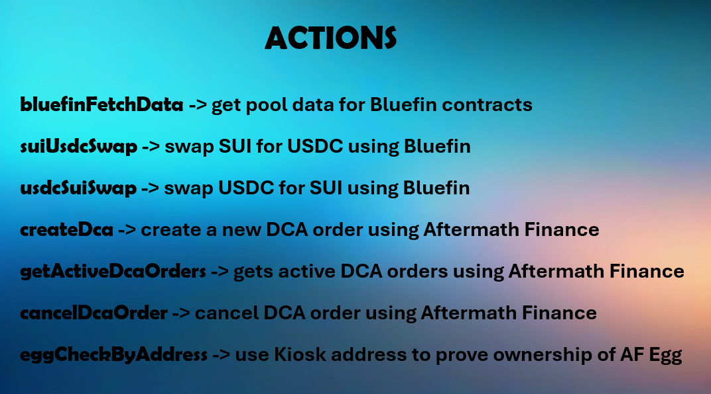

# DCA 

`pnpm clean`

`nvm use 23.3.0`

`pnpm install --no-frozen-lockfile && pnpm build`

`pnpm run dev`

===
START CHARACTER

`NODE_OPTIONS="max-old-space-size=32768" pnpm start --character="characters/thoreau.character.json"`

nvm use 23.3.0
pnpm start --character="characters/thoreau.character.json"

===

